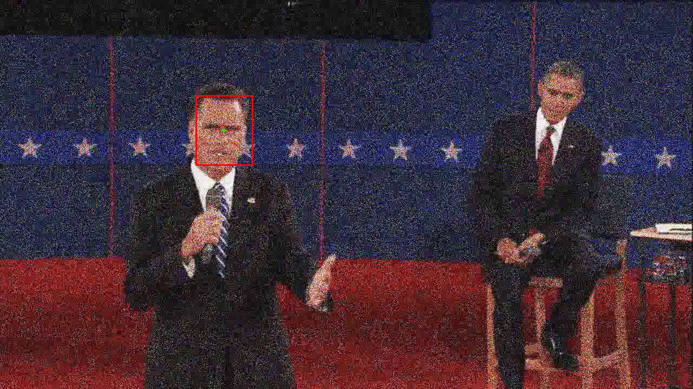
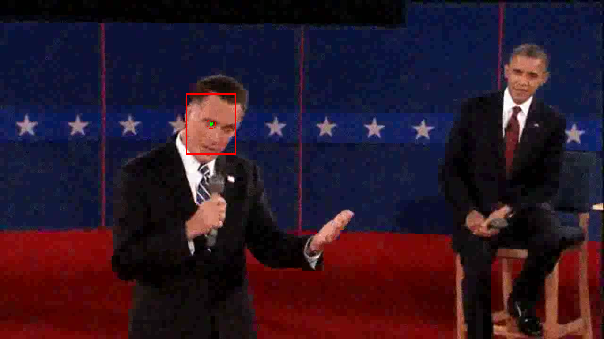
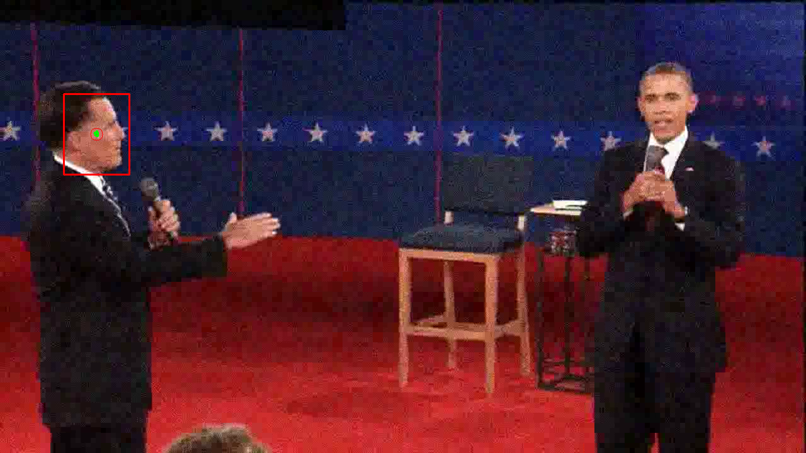
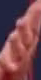
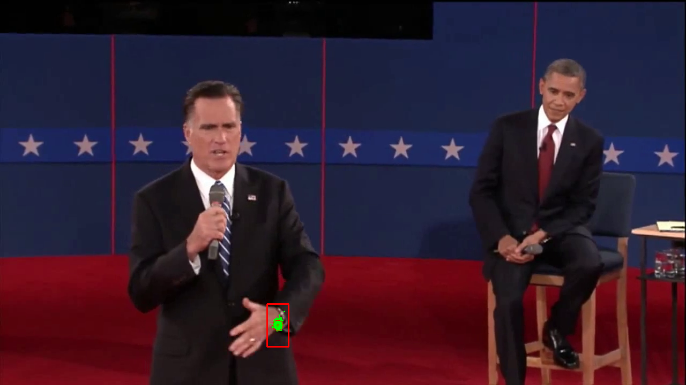
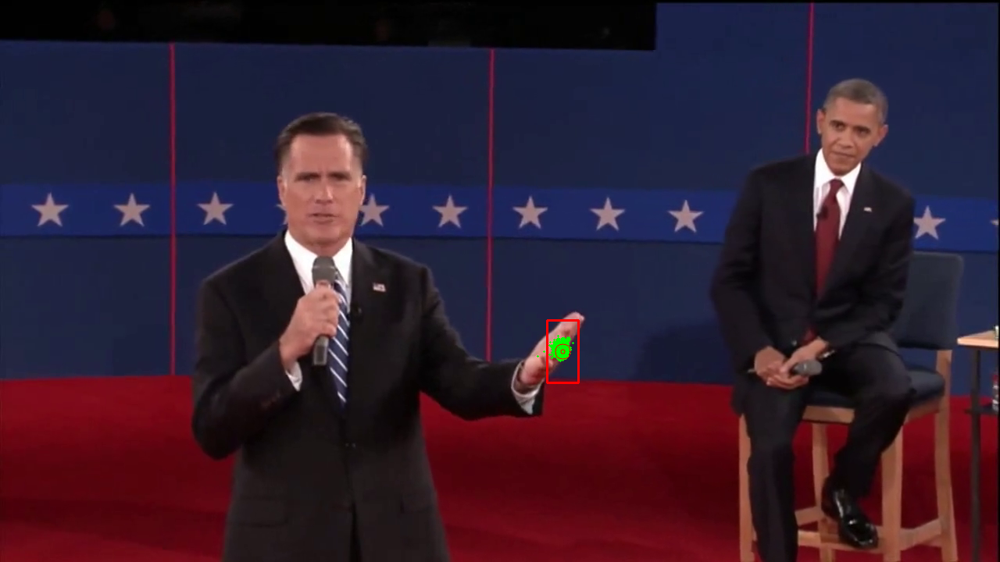
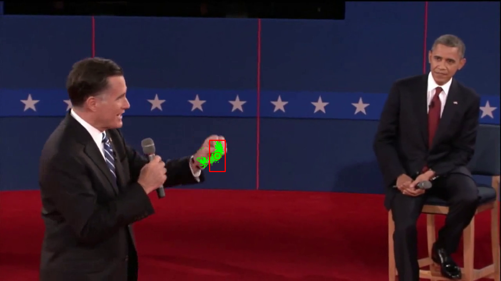

# Motion Tracking with Partical Filter
Using partical filter to track body movements in videos

## Head recognition in noisy video stream

## Hand recognition with mean shift partical filter
### Starting template

### Tracking hand motion

